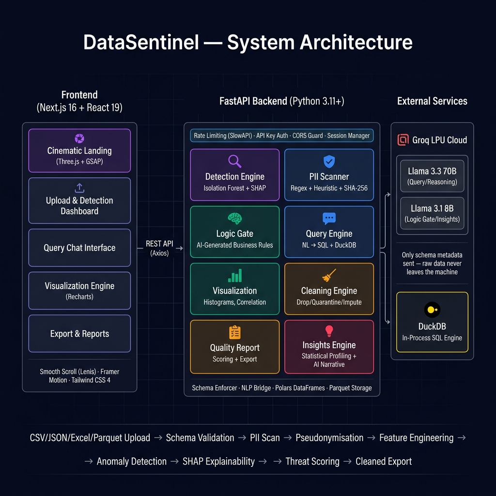

<p align="center">
  
  
  
  
  
</p>

<h1 align="center">🛡️ DataSentinel</h1>

<p align="center">
  <strong>AI-Powered Anomaly Detection &amp; Data Quality Platform</strong><br/>
  Upload any dataset. Detect anomalies. Clean. Query. Export — all in one cinematic pipeline.
</p>

<p align="center">
  <a href="#-quick-start">Quick Start</a> •
  <a href="#-features">Features</a> •
  <a href="#-architecture">Architecture</a> •
  <a href="#-project-structure">Project Structure</a> •
  <a href="#-api-reference">API Reference</a> •
  <a href="#-tech-stack">Tech Stack</a> •
  <a href="#-environment-variables">Environment Variables</a>
</p>

---

## ✨ Features

| Feature | Description |
|---------|-------------|
| **🔍 Anomaly Detection** | Isolation Forest + SHAP explainability for every flagged row |
| **🛡️ PII Scanner** | Local-edge PII detection & SHA-256 pseudonymisation before any cloud call |
| **🧠 Neuro-Symbolic Logic Gate** | AI-generated mathematical rules that validate data integrity |
| **⚡ Groq LPU Acceleration** | Llama 3.3 70B on Groq's Language Processing Units for millisecond inference |
| **🧹 Smart Cleaning** | Drop or quarantine anomalies with before/after comparison |
| **💬 Natural Language Query** | Ask questions in plain English — DataSentinel generates & executes SQL |
| **📊 Visual Analytics** | Correlation heatmaps, distribution histograms, categorical breakdowns |
| **📋 Quality Reports** | Exportable data quality scorecards with health metrics |
| **🎬 Cinematic UI** | GSAP scroll-driven animations, Three.js PurificationCore & NeuralCore, smooth Lenis scrolling |

---

## 🚀 Quick Start

### Prerequisites

| Tool | Version | Purpose |
|------|---------|---------|
| **Python** | 3.11+ | Backend runtime |
| **Node.js** | 18+ | Frontend runtime |
| **npm** | 9+ | Package management |
| **Groq API Key** | — | LLM inference ([Get one free](https://console.groq.com)) |

### 1. Clone the Repository

```bash
git clone https://github.com/GhoshChinmay/DSV2.git
cd DSV2
```

### 2. Backend Setup

```bash
cd backend

# Create and activate a virtual environment (recommended)
python -m venv venv

# Windows
venv\Scripts\activate

# macOS/Linux
source venv/bin/activate

# Install dependencies
pip install -r requirements.txt
```

### 3. Configure Environment Variables

Create a `.env` file inside the `backend/` directory:

```env
# Required — your Groq Cloud API key
GROQ_API_KEY=gsk_your_key_here

# Optional — secure your API endpoints with a key
# DS_API_KEY=your_secure_api_key

# Optional — salt for PII pseudonymisation
# DS_PII_SALT=your_custom_salt

# Optional — CORS whitelist (defaults to localhost:3000)
# CORS_ORIGINS=http://localhost:3000,http://127.0.0.1:3000
```

### 4. Start the Backend

```bash
cd backend
uvicorn main:app --reload
```

The backend will start at **http://localhost:8000**. Verify by visiting:
```
http://localhost:8000/          → {"status": "DataSentinel detection engine is online."}
http://localhost:8000/docs      → Interactive Swagger API docs
```

### 5. Frontend Setup

Open a **new terminal**:

```bash
cd frontend

# Install dependencies
npm install
```

### 6. Start the Frontend

```bash
npm run dev
```

The application will be available at **http://localhost:3000**.

---

## 🏗️ Architecture

```
┌──────────────────────────────────────────────────────────────────┐
│                        BROWSER (Next.js 16)                      │
│  ┌──────────┐ ┌──────────┐ ┌──────────┐ ┌──────────┐            │
│  │ Detection │ │ Insights │ │ Cleaning │ │  Query   │  ...       │
│  └────┬─────┘ └────┬─────┘ └────┬─────┘ └────┬─────┘            │
│       └────────────┴────────────┴────────────┘                   │
│                        Axios API Service                         │
└───────────────────────────┬──────────────────────────────────────┘
                            │ HTTP / REST
┌───────────────────────────▼──────────────────────────────────────┐
│                   FastAPI Backend (Python)                        │
│  ┌─────────────────────────────────────────────────────────────┐ │
│  │                      main.py (Router)                       │ │
│  │  Rate Limiting (SlowAPI) · Auth Guard · CORS · Validation   │ │
│  └──────┬──────┬──────┬──────┬──────┬──────┬──────┬────────────┘ │
│         │      │      │      │      │      │      │              │
│    Detection Cleaning Insights Query  Viz  Quality PII Scanner   │
│    (IForest  (Polars) (Groq)  (Duck  (Polars)(Polars)(Regex+     │
│     +SHAP)            (LLM)   DB+    +Stats)        Heuristic)   │
│                                Groq)                             │
│  ┌─────────────────────────────────────────────────────────────┐ │
│  │  Logic Gate: AI-generated mathematical validation rules     │ │
│  │  Groq Client: Centralized LLM wrapper with retry logic      │ │
│  │  Schema Enforcer: Data contract validation                  │ │
│  └─────────────────────────────────────────────────────────────┘ │
│                                                                  │
│  Storage: Parquet files in sessions/{uuid}/                      │
└──────────────────────────────────────────────────────────────────┘
```



### Data Flow

1. **Upload** → File parsed (CSV/JSON/Excel/Parquet) → Schema validation → Parquet storage
2. **PII Scan** → Regex + heuristic scan → Optional SHA-256 pseudonymisation
3. **Detection** → NLP feature engineering → Neuro-Symbolic Logic Gate → Isolation Forest → SHAP explainability → Threat scoring
4. **Insights** → Statistical profiling → Groq LLM narrative generation
5. **Cleaning** → Drop, quarantine, winsorize, mask, or impute anomalies → Save cleaned dataset
6. **Query** → Natural language → Groq generates SQL → DuckDB executes → Self-healing retry loop
7. **Export** → Quality report generation → CSV download

---

## 📁 Project Structure

```
DSV2/
├── backend/
│   ├── main.py                 # FastAPI application & route definitions
│   ├── auth.py                 # API key authentication guard
│   ├── schema.py               # Data contract validation (SchemaEnforcer)
│   ├── utils.py                # Session management, logging utilities
│   ├── groq_client.py          # Centralized Groq LLM client with retries
│   ├── core_engine.py          # Backward compatibility shim (deprecated)
│   ├── engines/
│   │   ├── __init__.py         # Re-exports all engine functions
│   │   ├── detection.py        # Isolation Forest + SHAP anomaly detection
│   │   ├── cleaning.py         # Drop/quarantine anomaly cleaning
│   │   ├── insights.py         # Statistical profiling + AI narrative
│   │   ├── query.py            # Natural language → SQL via Groq + DuckDB
│   │   ├── visualization.py    # Chart data aggregation
│   │   ├── quality.py          # Data quality report generation
│   │   ├── logic_gate.py       # AI-generated mathematical validation rules
│   │   ├── nlp_bridge.py       # NLP feature engineering for text columns
│   │   └── pii_scanner.py      # PII detection & pseudonymisation
│   ├── data/
│   │   ├── fraud_transactions.csv
│   │   ├── patient_vitals.csv
│   │   └── ecommerce_reviews.csv
│   ├── tests/
│   │   ├── conftest.py
│   │   ├── test_api.py
│   │   ├── test_cleaning.py
│   │   ├── test_detection.py
│   │   ├── test_insights.py
│   │   ├── test_query.py
│   │   └── test_schema.py
│   ├── requirements.txt
│   └── .env                    # Environment variables (not committed)
│
├── frontend/
│   ├── src/
│   │   ├── app/
│   │   │   ├── page.tsx        # Main application page & pipeline orchestrator
│   │   │   ├── layout.tsx      # Root layout with SmoothScroller
│   │   │   └── globals.css     # Global styles & Tailwind config
│   │   ├── components/
│   │   │   ├── landing/
│   │   │   │   ├── HeroLanding.tsx        # GSAP scroll-driven cinematic intro
│   │   │   │   ├── PurificationCore.tsx   # Three.js data purification animation
│   │   │   │   ├── NeuralCore.tsx         # Three.js neural network background
│   │   │   │   └── AmbientAurora.tsx      # CSS ambient aurora backdrop
│   │   │   ├── detection/      # Anomaly detection results table
│   │   │   ├── insights/       # AI-generated insights dashboard
│   │   │   ├── clean/          # Cleaning action panel
│   │   │   ├── compare/        # Before/after dataset comparison
│   │   │   ├── review-edit/    # Data review & edit interface
│   │   │   ├── visualizer/     # Charts (histograms, heatmaps, scatter)
│   │   │   ├── query/          # Natural language query chat interface
│   │   │   ├── export-report/  # Quality report export
│   │   │   ├── pii-modal/      # PII detection modal
│   │   │   └── SmoothScroller.tsx  # Lenis smooth scroll wrapper
│   │   ├── hooks/
│   │   │   ├── use-detection.ts
│   │   │   ├── use-compare.ts
│   │   │   ├── use-query.ts
│   │   │   └── use-viz.ts
│   │   ├── services/
│   │   │   └── api.service.ts  # Axios instance with auth interceptor
│   │   ├── types/
│   │   │   └── api.ts          # Shared TypeScript interfaces
│   │   └── constants/
│   │       └── config.ts       # API base URL & key configuration
│   ├── package.json
│   ├── tsconfig.json
│   ├── next.config.ts
│   ├── eslint.config.mjs
│   └── postcss.config.mjs
│
└── README.md
```

---

## 📡 API Reference

All endpoints are served at `http://localhost:8000`. Interactive docs at `/docs`.

### Core Pipeline

| Method | Endpoint | Description |
|--------|----------|-------------|
| `GET` | `/` | Health check |
| `GET` | `/api/health` | Verify Groq API connectivity |
| `POST` | `/api/upload/` | Upload a dataset (CSV, JSON, Excel) |
| `GET` | `/api/data/{session_id}` | Fetch dataset rows (with pagination) |
| `POST` | `/api/clean/{session_id}` | Clean anomalies (action: `drop` or `quarantine`) |
| `GET` | `/api/compare/{session_id}` | Compare raw vs cleaned data |
| `GET` | `/api/viz/{session_id}` | Get visualization aggregations |
| `GET` | `/api/insights/{session_id}` | Generate AI insights & statistical profiles |
| `POST` | `/api/query/{session_id}` | Natural language data query |
| `POST` | `/api/confirm-edit/{session_id}` | Execute a confirmed SQL edit |
| `GET` | `/api/report/{session_id}` | Generate quality report |
| `GET` | `/api/download/{session_id}` | Download cleaned CSV |

### Privacy & Security

| Method | Endpoint | Description |
|--------|----------|-------------|
| `GET` | `/api/pii-scan/{session_id}` | Scan for PII in uploaded data |
| `POST` | `/api/pseudonymise/{session_id}` | SHA-256 pseudonymise PII columns |
| `GET` | `/api/quarantine/{session_id}` | View quarantined anomaly rows |
| `POST` | `/api/feedback/` | Submit anomaly feedback |

### Sample Datasets

| Method | Endpoint | Description |
|--------|----------|-------------|
| `GET` | `/api/samples` | List available built-in sample datasets |
| `POST` | `/api/load-sample/{filename}` | Load a sample through the detection pipeline |

---

## 🔧 Tech Stack

### Backend

| Package | Version | Purpose |
|---------|---------|---------|
| FastAPI | 0.115 | REST API framework |
| Polars | 1.27 | High-performance DataFrame operations |
| scikit-learn | 1.6 | Isolation Forest anomaly detection |
| SHAP | 0.46 | Model explainability |
| DuckDB | 1.2 | In-process SQL engine for NL queries |
| Groq SDK | latest | LLM inference (Llama 3.3 70B) |
| SlowAPI | 0.1.9 | Rate limiting middleware |
| Pandas | 2.2 | Excel/fallback CSV parsing |

### Frontend

| Package | Version | Purpose |
|---------|---------|---------|
| Next.js | 16 | React framework with App Router |
| React | 19 | UI library |
| Three.js | 0.183 | 3D particle visualization |
| @react-three/fiber | 9.6 | React renderer for Three.js |
| GSAP | 3.15 | Scroll-driven cinematic animations |
| Lenis | 1.3 | Butter-smooth scroll engine |
| Framer Motion | 12 | Page transitions & micro-animations |
| Recharts | 3.8 | Data visualization charts |
| Tailwind CSS | 4 | Utility-first styling |
| Axios | 1.14 | HTTP client |

---

## 🔐 Environment Variables

### Backend (`backend/.env`)

| Variable | Required | Default | Description |
|----------|----------|---------|-------------|
| `GROQ_API_KEY` | ✅ Yes | — | Your Groq Cloud API key |
| `DS_API_KEY` | No | — | API key to protect endpoints (enables auth) |
| `DS_PII_SALT` | No | Built-in default | Cryptographic salt for PII hashing |
| `CORS_ORIGINS` | No | `localhost:3000` | Comma-separated allowed origins |

### Frontend (`frontend/.env.local`)

| Variable | Required | Default | Description |
|----------|----------|---------|-------------|
| `NEXT_PUBLIC_API_URL` | No | `http://127.0.0.1:8000` | Backend URL |
| `NEXT_PUBLIC_API_KEY` | No | — | Must match `DS_API_KEY` if auth is enabled |

---

## 🧪 Running Tests

### Backend

```bash
cd backend
pytest -v
```

### Frontend

```bash
cd frontend

# Type checking
npx tsc --noEmit

# Lint
npx eslint src/
```

---

## 🗒️ Usage Guide

1. **Open** the app at `http://localhost:3000`
2. **Scroll** through the cinematic landing page
3. **Upload** your CSV, JSON, or Excel file — or try a built-in sample dataset
4. **Review** detected anomalies with AI-generated explanations and SHAP attributions
5. **Explore** AI-generated insights and statistical profiles
6. **Clean** the dataset by dropping or quarantining flagged rows
7. **Compare** the raw vs cleaned data side-by-side
8. **Edit** data using the review panel
9. **Visualize** distributions, correlations, and categorical breakdowns
10. **Query** your data using natural language (e.g., *"Show me all transactions above $10,000"*)
11. **Export** a quality report and download the cleaned CSV

---

## 📜 License

This project is for educational and portfolio purposes.

---