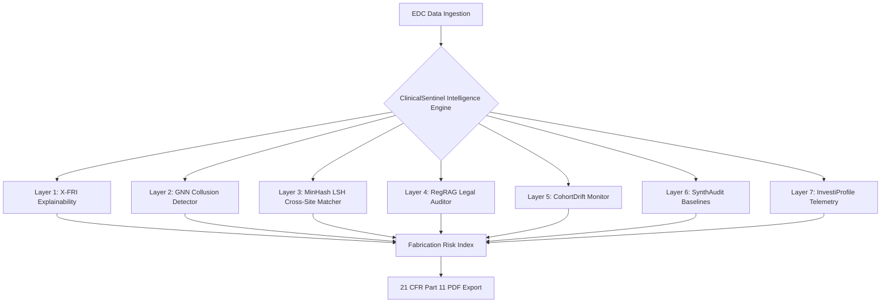

<div align="center">

# ⚕️ ClinicalSentinel

**The Next-Generation Forensic Audit Platform for Clinical Trials**

<br>

[](#)
[](#)
[](#)
[](#)
[](#)

<p align="center">
  <em>Detect data fabrication, temporal manipulation, and collusion in EDC systems with mathematical precision and AI-driven forensic intelligence.</em>
</p>

[**Features**](#-core-features) • [**Architecture**](#-the-7-layer-forensic-architecture) • [**Compliance**](#-regulatory-compliance) • [**Installation**](#-installation--setup) • [**Tech Stack**](#-tech-stack)

</div>

<br>

<div align="center">
  
</div>

---

## 📖 Overview

**ClinicalSentinel** is a highly specialized, patentable forensic intelligence platform designed specifically for the pharmaceutical and clinical research industries. It transcends standard statistical range-checks by implementing a robust, **7-layer anomaly detection pipeline**.

By identifying subtle patterns of data fabrication, identifying cohort drift, mapping collusion networks using Graph Neural Networks, and auto-verifying anomalies against regulatory law via an embedded LLM RAG engine, ClinicalSentinel ensures **uncompromising data integrity** for your clinical trials.

---

## ✨ Core Features

<details open>
<summary><b>🔍 Multi-Dimensional Fraud Detection</b></summary>
<p>Identifies data fabrication across numeric, categorical, and temporal dimensions. Analyzes behavioral telemetry and digit distributions (Benford's Law) to flag non-human data generation.</p>
</details>

<details open>
<summary><b>⚖️ Automated Regulatory Triage (RegRAG)</b></summary>
<p>Evaluates findings directly against ICH E6(R3) and FDA 21 CFR Part 11 guidelines using a local ChromaDB vector store and Llama 3 LLM inference.</p>
</details>

<details open>
<summary><b>📊 21 CFR Part 11 PDF Audit Reports</b></summary>
<p>Automatically synthesizes legally compliant forensic PDF reports, complete with reproducible metrics and mathematically guaranteed audit trails.</p>
</details>

<details open>
<summary><b>⚡ Real-Time Polars Pipeline</b></summary>
<p>Powered by Rust-backed Polars and FastAPI, easily scaling to handle millions of EDC rows with microsecond latency.</p>
</details>

<details open>
<summary><b>🎨 Premium Next.js Intelligence Dashboard</b></summary>
<p>A sleek, interactive, dark-mode Next.js UI showcasing real-time visualizations, interactive threshold sliders, and SHAP-based counterfactual explanations.</p>
</details>

---

## 🧬 The 7-Layer Forensic Architecture

ClinicalSentinel evaluates clinical datasets through seven independent intelligence layers, culminating in a mathematically robust **Fabrication Risk Index (FRI)** for every investigator.



### 🔬 F1: X-FRI (Explainable Fabrication Risk Index)
Decomposes the composite FRI score using **SHAP (SHapley Additive exPlanations)**. Translates complex machine learning outputs into human-readable narratives, explaining exactly which clinical metrics drove the anomaly flag.

### 🕸️ F2: GNN-Collusion Detector
Leverages **Graph Convolutional Networks (GCNs)** (with deterministic network smoothing fallback heuristics) to build relationship graphs between investigators. Maps shared metadata to identify high-risk "collusion rings" coordinating fraudulent data entry.

### 🔍 F3: Cross-Site MinHash LSH Matcher
Implements advanced **MinHash Local Sensitive Hashing (LSH)** to detect when investigators copy-paste patient data from other sites or patients, slightly modifying values to avoid exact-match detection.

### 📜 F4: RegRAG (Regulatory Compliance Auto-Checker)
An advanced **Retrieval-Augmented Generation (RAG)** pipeline powered by ChromaDB. Cross-references detected dataset anomalies against a vector store of statutory laws (FDA 21 CFR Part 11 text included) to generate legally grounded compliance verdicts.

### 📉 F5: CohortDrift
Identifies when a specific cohort statistically deviates from the study-wide baseline over time. Utilizes **Kolmogorov-Smirnov (KS)** tests to spot systemic manipulation and dataset degradation.

### 🤖 F6: SynthAudit (Synthetic Reference Baselines)
Generates a statistically flawless "clean" baseline using a **Gaussian Copula** derived strictly from the safest 40% of historically trusted investigator data. Audits incoming investigator data against this synthetic twin to detect hyper-subtle deviations.

### 🧑‍⚕️ F7: InvestiProfile (Behavioral Profiling)
Flags abnormal human data-entry behaviors via mathematical profiling. Detects uncharacteristic data entry velocity, unnatural temporal spacing, and suspicious activity timings outside of expected clinical operating hours.

---

## 🏛️ Regulatory Compliance

ClinicalSentinel is engineered from the ground up to support submissions to regulatory authorities (FDA, EMA, PMDA).

| Regulation | ClinicalSentinel Coverage |
| :--- | :--- |
| **FDA 21 CFR Part 11** | Secure, system-generated UTC timestamps. Mathematical reproducibility via fixed ML seeds. Strict programmatic PDF audit generation. |
| **ICH E6(R3) GCP** | Centralized statistical monitoring to identify systematic or significant errors in data collection (RBQM). |
| **Data Privacy** | In-memory processing architecture ensures patient PII/PHI is never leaked or stored improperly. |

---

## 🛠️ Tech Stack

<div align="center">

| Domain | Core Technologies |
| :--- | :--- |
| **Backend Framework** | `FastAPI`, `Python 3.10+`, `Uvicorn` |
| **Data Engineering** | `Polars`, `NumPy`, `Pandas` |
| **Machine Learning** | `PyTorch Geometric`, `scikit-learn`, `datasketch` (MinHash LSH) |
| **Explainable AI** | `SHAP`, `SDV` (Synthetic Data Vault), `DiCE` |
| **GenAI & RAG** | `LangChain`, `Groq (Llama 3)`, `ChromaDB` |
| **Frontend Platform** | `Next.js 14`, `React 19`, `Tailwind CSS 4` |
| **Interactive UI/UX** | `Framer Motion`, `Recharts`, `Lucide Icons` |

</div>

---

## 💻 Installation & Setup

### Prerequisites
*   **Node.js** (v18.0 or newer)
*   **Python** (v3.10 or newer)
*   **Git**

### 1. Clone the Repository
```bash
git clone https://github.com/GhoshChinmay/ClinicalSentinel.git
cd ClinicalSentinel
```

### 2. Backend Setup (FastAPI Engine)
Initialize your Python environment and install the required forensic dependencies:

```bash
cd backend
python -m venv venv

# Activate the virtual environment:
# On Windows:
venv\Scripts\activate
# On macOS/Linux:
source venv/bin/activate

# Install core forensic dependencies:
pip install -r requirements.txt

# NOTE: Advanced forensic layers (F2: GNN Collusion) require PyTorch.
# If you need GNN capabilities, follow the specific install instructions
# inside `requirements.txt` for your CPU/CUDA environment.
```

> [!IMPORTANT]
> The `requirements.txt` file is categorized into core stacks and the **7-Layer Forensic Architecture** dependencies. Please review the internal comments in `requirements.txt` if you need to enable hardware-accelerated GNN detection.

**Configure Backend Environment Variables:**
Create a `.env` file in the `backend` directory:
```ini
DS_API_KEY=your_secure_api_key_here
GROQ_API_KEY=your_groq_api_key_here
```

**Launch the Backend Engine:**
```bash
uvicorn main:app --reload
```
*The API will start on `http://127.0.0.1:8000`*

### 3. Frontend Setup (Next.js Dashboard)
Open a new terminal window:

```bash
cd frontend
npm install
```

**Configure Frontend Environment Variables:**
Create a `.env.local` file in the `frontend` directory:
```ini
NEXT_PUBLIC_API_URL=http://127.0.0.1:8000
NEXT_PUBLIC_API_KEY=your_secure_api_key_here
```

**Launch the Frontend Dashboard:**
```bash
npm run dev
```
*The web dashboard will be available at `http://localhost:3000`*

---

## 📚 API Architecture Quick Reference

ClinicalSentinel exposes a robust REST API for integrating into existing EDC/CTMS systems:

*   `POST /api/upload`: Ingest clinical datasets (CSV/Parquet).
*   `GET /api/clinical/xfri/{session_id}`: Retrieve SHAP decompositions (F1).
*   `GET /api/clinical/gnn-collusion/{session_id}`: Generate investigator graph edges (F2).
*   `POST /api/clinical/reg-rag/init`: Prime the ChromaDB vector store (F4).
*   `GET /api/download_report/{session_id}`: Generate a 21 CFR Part 11 PDF audit.

---

<div align="center">
  
  <p><strong>Built with precision for the future of clinical research.</strong></p>
  <p>&copy; 2026 GhoshChinmay. All Rights Reserved.</p>
</div>